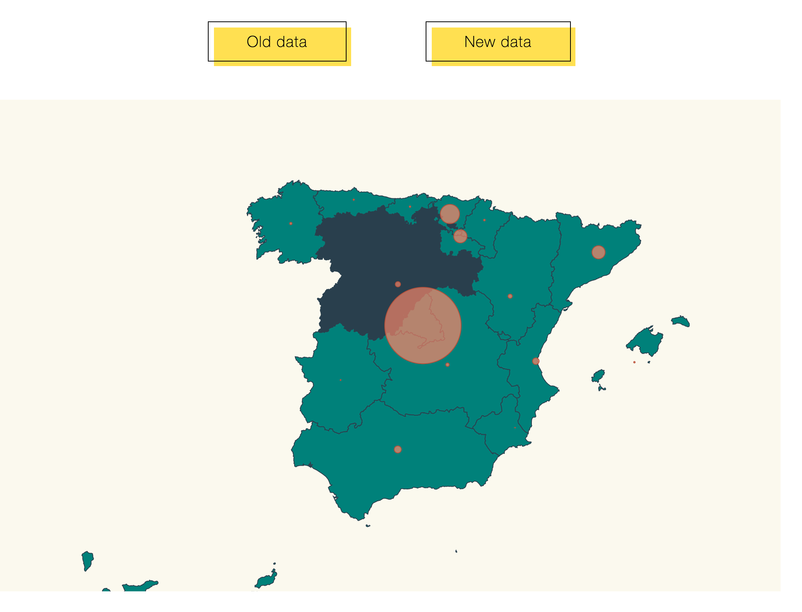

By: @Milagros Bernardi (UMA - VI MÁSTER PROPIO UNIVERSITARIO EN ADVANCED ANALYTICS ON BIG DATA (2021-23))

# Advanced activity

## Adding colour markers to the Autonomous Communities.

### Starting the code:

- clone the repository by performing the command:

```shell
git clone https://github.com/mililic85/DataVisualization/advanced
```

- run the code in shell to install the dependencies:

```shell
npm install
```
- start npm by performing the command:

```shell
npm start
```
- go to a web explorer and type:

```
localhost:1234
```
- The webpage is displayed. To change the data displayed, click in the buttons. First data displayed is the "old data".

- When the mouse is on an Autonomus Community, will be marked in a dark colour.

Here you can find a webpage that displays a map from Spain  pinning coronavirus affected locations and scaling that pin according the number of cases affected. Additionally, you can choose by pressing the buttons at the above, between "old data" and "new data" meaning the total cases for earlier stage and the last updated data (up to Jul, 17th). When the mouse is on an Autonomus Community, will be marked in a dark colour



From the mandatory task, I have performed one update:

- added the commands over the map in order to paint the region when the mouse is over, and return to the original colour when the mouse is out.

### Steps

- I have taken as starting point the [mandatory task](https://github.com/mililic85/DataVisualization), copied the content from that folder and added the above described updates.

To do that, I had to take the original repository and make a new branch that I named "advanced": 


  ```bash
  git checkout -b advanced
  git add .
  git commit -m "advance exercise"
  git push --set-upstream origin advanced
  ```

Then, I had to modify the map by adding:  

``` diff 
svg
  .selectAll("path")
  .data(geojson["features"])
  .enter()
  .append("path")
  .attr("class", "country")
+  .on("mouseover", function(d) {
+    d3.select(this).style("fill", "#2f4858");
+  })
+  .on("mouseout", function(d) {
+    d3.select(this).style("fill", "#008c86");})
  // data loaded from json file
  .attr("d", geoPath as any);
```
This change the colour to `#2f4858` when the mouse is over that HTML class, and return to the original colour `"#008c86"` when the mouse is out.


