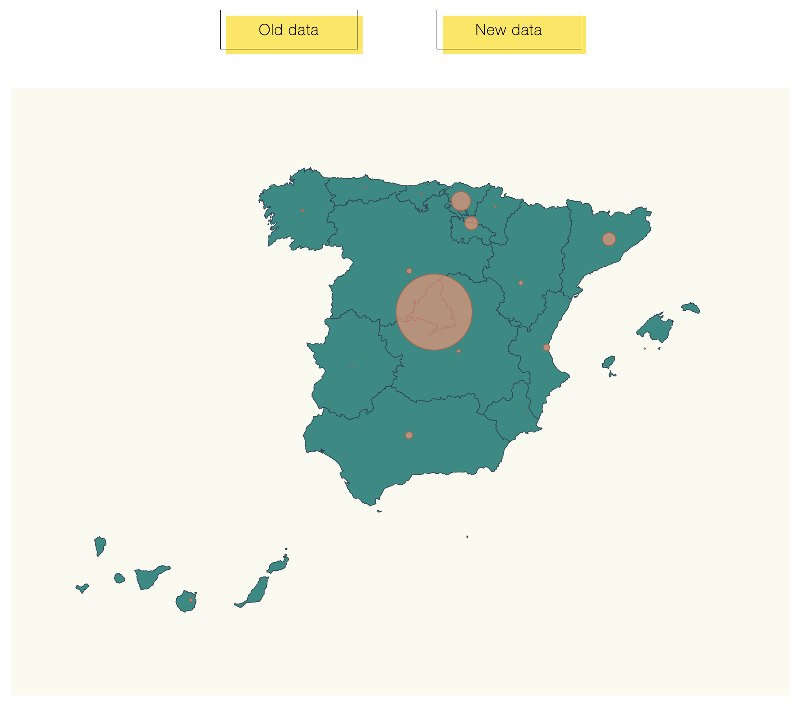

# Adding buttons and updating data of coronavirus incidence by autonomus community in Spain.

# Starting the code

- clone the repositorie by performing the command:

```shell
git clone <GitHub Shell URL>
```

- run the code in shell to install the dependencies:

```shell
npm install
```
- start npm by performing the command:

```shell
npm start
```
- go to a web explorer and type:

```
localhost:1234
```
- The webpage is displayed. To change the data displayed, clik in the buttons. First data displayed is the "old data".


By: @Milagros Bernardi (UMA - Data Analytics and Big Data)

Here you can find a webpage that displays a map from Spain  pinning coronavirus affected locations and scaling that pin according the number of cases affected. Additionally, you can choose by pressing the buttons at the above, between "old data" and "new data" meaning the total cases for earlier stage and the last updated data (up to Jul, 17th):



I have performed two main tasks:

- Placed buttons for the different data options.
- Added the transition of data in the map by updating the information (scaling the circles with the new data)

# Steps

- I have taken as starting point the  example 02-maps, copied the content from that folder and added the above described updates.

To do that, I had to clone the [GitHub](https://github.com/Lemoncode/d3js-typescript-examples/tree/master/02-maps/02-pin-location-scale) repository and performed the installation of dependencies described in `package.json`:

- Install npm:
  ```bash
  npm install
  ```

Then, I had to look for the most updated covid data info for the autonomous communities in Spain. I just googled it and copied the numbers that google collect for us in a new data file: `stats_17_jul.ts` 

``` typescript

export const stats_17_jul = [
    {
      name: "Madrid",
      value: 1880
    },
    {
      name: "La Rioja",
      value: 106
    },
    {
      name: "Andalucía",
      value: 1550
    },
    {
      name: "Cataluña",
      value: 2590
    },
    {
      name: "Valencia",
      value: 1510
    },
    {
      name: "Murcia",
      value: 445
    },
    {
      name: "Extremadura",
      value: 294
    },
    {
      name: "Castilla La Mancha",
      value: 567
    },
    {
      name: "País Vasco",
      value: 755
    },
    {
      name: "Cantabria",
      value: 154
    },
    {
      name: "Asturias",
      value: 249
    },
    {
      name: "Galicia",
      value: 711
    },
    {
      name: "Aragón",
      value: 449
    },
    {
      name: "Castilla y León",
      value: 797
    },
    {
      name: "Islas Canarias",
      value: 425
    },
    {
      name: "Islas Baleares",
      value: 303
    },
    {
      name: "Navarra",
      value: 251
    }
  ];
  ```

### Changes in `index.ts`

In order to keep the names in the code for `stats`, I followed these steps:

- Imported to `index.ts` the "old data" `stats.ts` with an alias:

```typescript
import { stats as stats_original} from "./stats";
```
- Imported the "new data" into `index.ts`:

```typescript
import { stats_17_jul } from "./stats_17_jul"
```

- Declare `stats` as a variable:

```typescript
var stats = stats_original
```

Then, modified the script as follows:

- Declare `updateChart` that uses `data` as input (this is the "old stats" or the "updated stats") that would be the change triggered by the user depending on the button clicked. First, the `stats` var will assume the `data` value. Then, `maxAffected` have to been updated based in the new value of the `stats`. Next, the `affectedRadiusScale` of the circles representing the cases per autonomous communities have to be resized based on the new value for `maxAffected` constant. The last piece of code selects all the circles in the current map, and performs the transition for the radious size based on the method `calculateRadiusBasedOnAffectedCases` per every `name` value in the file `latLongCommunities`:

```typescript
const updateChart = (data: { name: string; value: number; }[]) => {
  stats = data;
  maxAffected = stats.reduce(
    (max, item) => (item.value > max ? item.value : max),
    0
  );
  affectedRadiusScale = d3
  .scaleLinear()
  .domain([0, maxAffected])
  .range([0, 50]);

  svg
  .selectAll("circle")
  .data(latLongCommunities) 
  .transition()
  .duration(500)
  .attr("r", d => calculateRadiusBasedOnAffectedCases(d.name));
};
```

The map and the position of the circles remains tha same after a mouse click in the new buttons, so other changes are not necessary in the `updateChart` function.

- Next, I had to add the `click button command` for every button to add.
The below code takes the `document` HTML interface and selects the button by the `id` attribute. I my case the button `ids` are "old_data" and "new data". Then applies the `click Event` to the button, triggering the `updateChart` method with the corresponding stats data when the click is performed. 

``` typescript
document
  .getElementById("old_data")
  .addEventListener("click",
    () => {updateChart(stats_original)}
  );

document
  .getElementById("new_data")
  .addEventListener("click",
    () => {updateChart(stats_17_jul)}
  );
```

**Changes in `index.html`**

- Under the `<body>`, I added the new buttons, using the attribute `id` to name them and `class` as "fill". This way we guarantee the buttons we want to add, appear in the webpage when we display it.

``` HTML
<div>
      <button id="old_data" class="fill"> Old data </button>
      <button id="new_data" class="fill" > New data </button>
</div>
```

**Changes in `map.css`**

- I added the buttons, and centered the webpage. The design was taken from @Joe Bocock using this [code](https://codepen.io/joebocock/pen/ZEWoMPb), that, from my opinion, matches nicely with the pages aesthetic.

```css
html,
body {
  margin: 0;
  display: flex;
  justify-content: center;
  flex-direction: column;
  align-items: center;
  min-height: 100vh;
  font-family: "Roboto Mono", monospace;
}

button {
  margin: 50px;
  font-family: inherit;
}

.fill {
  font-size: 20px;
  font-weight: 200;
  letter-spacing: 1px;
  padding: 13px 50px 13px;
  outline: 0;
  border: 1px solid black;
  cursor: pointer;
  position: relative;
  background-color: rgba(0, 0, 0, 0);
}

.fill::after {
  content: "";
  background-color: #ffe54c;
  width: 100%;
  z-index: -1;
  position: absolute;
  height: 100%;
  top: 7px;
  left: 7px;
  transition: 0.2s;
}

.fill:hover::after {
  top: 0px;
  left: 0px;
}
```


